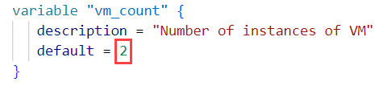

# Deploy a scalable IaaS web server in Azure

## Introduction
This project uses a Packer template and a Terraform template to deploy a customizable and scalable web server in Azure

## Getting Started
1. Clone this repository
2. Information about files 

        - tagging-policy-rule.json -> contains azure policy rule
        - server.json -> contains packer template to create linux image
        - main.tf and vars.tf -> contains terraform templates to create webserver
        - init.sh -> script that sets environment variables

## Dependencies
1. Create an [Azure Account](https://portal.azure.com) 
2. Install [Git Bash](https://git-scm.com/downloads)
2. Install the [Azure command line interface](https://docs.microsoft.com/en-us/cli/azure/install-azure-cli?view=azure-cli-latest)
3. Install [Packer](https://www.packer.io/downloads)
4. Install [Terraform](https://www.terraform.io/downloads.html)

## Server deployment
### Initialize environment variables
1. Use *init.sh* to set environment variables for azure authentication

        source init.sh

    

2. Login to Azure

        az login --service-principal -u $TF_VAR_ARM_client_id -p $TF_VAR_ARM_client_secret --tenant $TF_VAR_ARM_tenant_id

3. Set the subscription

        az account set --subscription $TF_VAR_ARM_subscription_id

4. Create resource group for server image and infrustructure resources

        az group create --name $TF_VAR_ARM_resource_group --location eastus

### Set azure policy
1. Create policy definition
    
        az policy definition create --name "tagging-policy-definition" --rules "tagging-policy-rule.json" --display-name "Deny creation of resources without tags" --description "This policy denies creation of a resources if that do not have tags" --subscription $TF_VAR_ARM_subscription_id --mode Indexed

2. Assign policy

        az policy assignment create --name "tagging-policy" --policy "tagging-policy-definition"

3. Verify policy

        az policy assignment list

    

### Create server image using packer
1. Run following command to create image in azure

        packer build server.json

    

### Create server infrastructure
1. Initialize terraform

        terraform init

    

2. Change *default* value of *vars.tf* file according to your requirement

    

2. Plan infrastructure deployment

        terraform plan -out solution.plan

    

    Check this image for full output of [solution.plan](misc/terraform-plan-full.png)

3. Deploy infrastructure

        terraform apply solution.plan

    

4. Get the public address and port to access the webserver

        az network public-ip list -g $TF_VAR_ARM_resource_group -o table
        az network lb inbound-nat-rule list -g $TF_VAR_ARM_resource_group --lb-name "udacity-web-server-lb" -o table

    

5. Access web server using **\<Address>:\<FrontendPort>**

    

*Use "terraform destroy" command to destroy the infrastructure*

## Troubleshooting

1. Error "Refused to connect"

    * If you see this error, it may be that webserver is not started.

        

    * Follow steps as below to start the webserver in the vm

            #!/bin/bash
            
            echo 'Hello, World!' > index.html
            nohup busybox httpd -f -p 80 &

        

